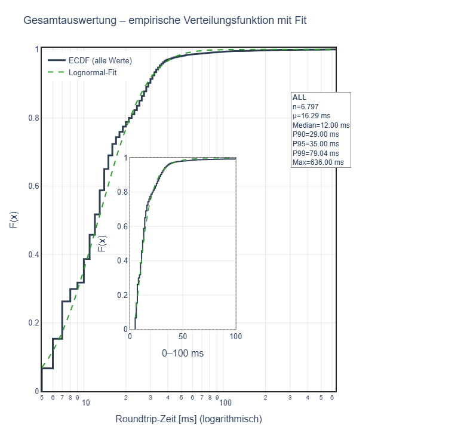
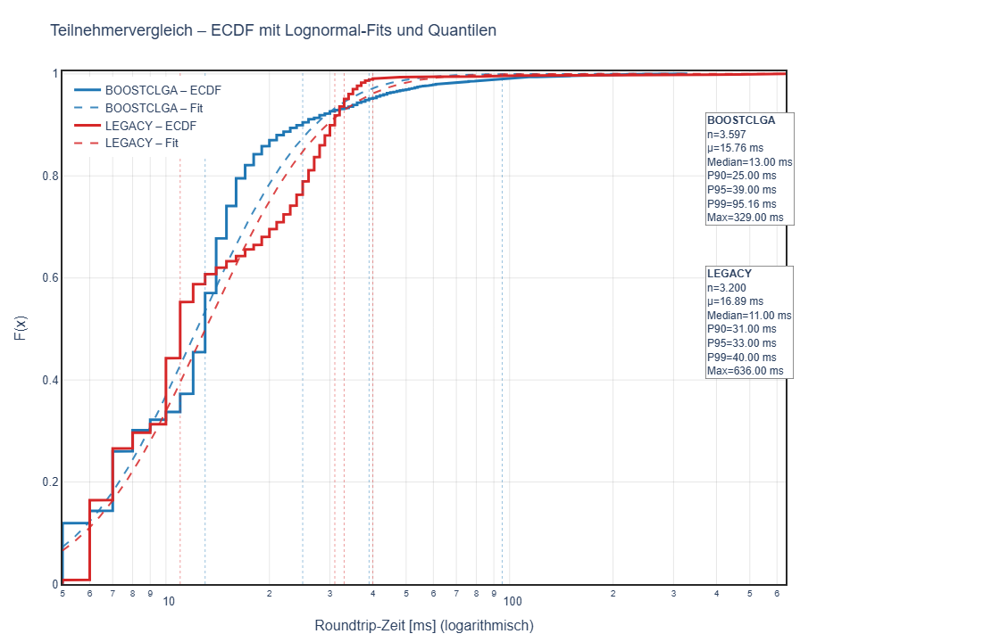
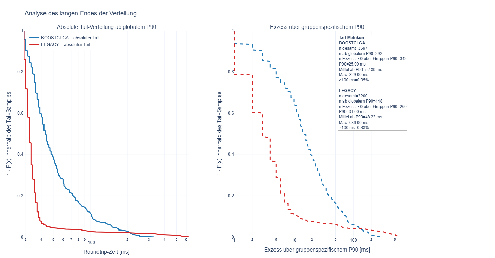

# Latenzanalyse "Legacy vrs. BOOST Cloud Gaming"

## Zusammenfassung

Die Analyse der Latenzmessungen zeigt ein insgesamt gutes Grundniveau der Netzwerkperformance, jedoch mit klaren Unterschieden zwischen den beiden betrachteten Ausprägungen BOOSTCLGA und LEGACY.

Beide Varianten liefern niedrige typische Latenzen und sind damit grundsätzlich für Gaming geeignet. Der zentrale Unterschied liegt jedoch nicht im Durchschnittsverhalten, sondern im Verhalten unter ungünstigen Bedingungen (oberer Bereich der Verteilung).

BOOSTCLGA zeigt die bessere Performance im Normalfall: Ein großer Anteil der Verbindungen weist sehr niedrige Latenzen auf, was zu einem direkten und reaktionsschnellen Nutzungserlebnis führt. Gleichzeitig ist jedoch ein ausgeprägter „Long Tail“ sichtbar, d. h. es treten häufiger und deutlich stärkere Latenzspitzen auf.

LEGACY hingegen ist im Durchschnitt etwas langsamer, zeigt aber ein deutlich stabileres Verhalten im oberen Bereich der Verteilung. Insbesondere hohe Latenzen (P95/P99) sowie extreme Ausreißer treten seltener und weniger stark auf.

Für die Nutzerwahrnehmung – insbesondere im Gaming – ist diese Stabilität entscheidend: Einzelne Latenzspitzen führen zu spürbaren Störungen („Lag-Spikes“), die die Qualität stärker beeinflussen als eine leicht erhöhte Grundlatenz.

In der Gesamtbewertung ergibt sich daher ein klarer Zielkonflikt:
- BOOSTCLGA optimiert auf Geschwindigkeit, mit erhöhter Varianz und Risiko für Ausreißer
- LEGACY optimiert auf Stabilität, mit leicht höherer, aber konstanter Latenz

Für latenzkritische und kompetitive Anwendungen ist die stabilere Charakteristik von LEGACY vorteilhaft, während BOOSTCLGA insbesondere für weniger kritische Nutzungsszenarien ein sehr gutes Performance-Niveau bietet.

Die Ergebnisse unterstreichen die Notwendigkeit, neben Medianwerten gezielt die oberen Quantile (P95, P99) und die Tail-Struktur zu betrachten, da diese maßgeblich die wahrgenommene Servicequalität bestimmen.

## Daten und Enthaltene Auswertungen
- Datenaufbereitung inkl. Extraktion der Metadaten aus dem Dateinamen
- Gesamtauswertung aller Messwerte
- Vergleich der Teilnehmer **BOOSTCLGA** vs. **LEGACY**
- Empirische Verteilungsfunktion (ECDF) mit Lognormal-Fit
- Inset-Fenster für **0–100 ms**
- Quantil-Linien für **P50 / P90 / P95 / P99**
- Auswertung des langen Endes der Verteilung **ab P90**
- Statistische Einschätzung, ob die Gruppen plausibel aus unterschiedlichen Grundgesamtheiten stammen
- Wiederverwendbare Figure-Builder für den späteren Transfer nach Dash

    Messwerte: 6.797
    Teilnehmer: ['BOOSTCLGA', 'LEGACY']
    Zugangsarten: ['LAN', 'WLAN']
    Load-Zustände: ['LOADOFF', 'LOADTCP8P', 'LOADYOUTUBE4K', 'LOADYOUTUBE4K+MAGENTATV20', 'LOADYOUTUBE4K+MAGENTATVMC']

## A Gesamtauswertung
Gesamtauswertung über aller Daten als kummulierte Verteilungsfunktion

## Analyse der empirischen Verteilungsfunktion (ECDF) von Ping-Messungen

### 1. Überblick
Der Plot zeigt die empirische Verteilungsfunktion (ECDF) der Roundtrip-Zeiten (RTT) in Millisekunden auf logarithmischer Skala sowie einen Lognormal-Fit. Zusätzlich sind statistische Kennwerte angegeben:

- Median: 12 ms  
- Mittelwert: 16.29 ms  
- P90: 29 ms  
- P95: 35 ms  
- P99: 79.04 ms  
- Maximum: 636 ms  

---

#### 2. Typisches Verhalten

#### 2.1 Steiler Anstieg im unteren Bereich (ca. 5–30 ms)
- Die ECDF steigt in diesem Bereich sehr steil an.
- Interpretation:  
  → Der Großteil der Messwerte liegt dicht beieinander im niedrigen Latenzbereich.  
  → Typisches Verhalten für stabile Netzwerkverbindungen.  

#### 2.2 Gute Annäherung durch den Lognormal-Fit (bis ~P90)
- Die gestrichelte Linie (Lognormal-Fit) folgt der ECDF eng.
- Interpretation:  
  → Die Latenzverteilung entspricht weitgehend einer lognormalen Verteilung.  
  → Klassisch für Netzwerk-Latenzen (Multiplikative Effekte, Queueing, etc.).

#### 2.3 Konsistenter Median vs. Mittelwert
- Median (12 ms) < Mittelwert (16.29 ms)
- Interpretation:  
  → Leichte Rechtsschiefe der Verteilung (typisch für Latenzwerte).  

---

### 3. Auffälliges Verhalten

#### 3.1 Abweichung im oberen Quantilbereich (ab ~P95)
- Ab etwa 35 ms beginnt die ECDF flacher zu werden.
- Der Lognormal-Fit unterschätzt teilweise die tatsächliche Verteilung.
- Interpretation:  
  → Erste Hinweise auf Heavy-Tail-Verhalten (mehr hohe Werte als erwartet).

---

#### 3.2 Deutlicher „Tail“ zwischen ~50 ms und 100 ms
- Sichtbar im Zoom-In (0–100 ms Bereich).
- ECDF steigt langsamer weiter.
- Interpretation:  
  → Sporadische Latenzspitzen („Jitter“).  
  → Mögliche Ursachen:
  - Netzwerkauslastung
  - Routing-Schwankungen
  - Serverantwortzeiten

---

#### 3.3 Extreme Ausreißer (bis 636 ms)
- Sehr große maximale RTT im Vergleich zu P99 (79 ms).
- Interpretation:  
  → Einzelne starke Latenzspikes (Outlier).  
  → Typisch für:
  - Paketverluste mit Retransmission
  - Bufferbloat
  - kurzzeitige Netzüberlastung
  - Scheduling-/Interrupt-Probleme

---

#### 3.4 Starke Differenz zwischen P99 und Maximum
- P99 = 79 ms vs. Max = 636 ms
- Interpretation:  
  → Extrem lange „lange Schwanz“-Verteilung (Long Tail).  
  → Für Gaming besonders kritisch (spürbare Lag-Spikes).

---

### 4. Gesamtbewertung

#### Typisch:
- Steiler ECDF-Anstieg im unteren Bereich
- Lognormal-artige Verteilung bis etwa P90
- Moderate Streuung im Kernbereich

#### Auffällig:
- Heavy Tail ab P95
- Sichtbare Jitter-Zone (50–100 ms)
- Extreme Ausreißer weit über P99 hinaus

---

### 5. Bedeutung für Gaming-Anwendungen

- **Positiv:**
  - Sehr gute Basislatenz (Median 12 ms)
  - Mehrheit der Pakete im optimalen Bereich

- **Kritisch:**
  - Sporadische hohe Latenzen → spürbare Ruckler / Lag
  - Long-Tail-Verhalten → inkonsistente Userexperience

---

## 6. Erstes Fazit

Die Verbindung zeigt insgesamt ein typisches Verhalten mit stabiler Grundlatenz, jedoch mit klar erkennbaren Auffälligkeiten im oberen Bereich der Verteilung. Insbesondere der lange Tail und die Ausreißer deuten auf instabile Netzwerkbedingungen unter Last oder sporadische Störungen hin.

## B Teilnehmervergleich Legacy vrs. BOOSTCGLA

### Kurzinterpretation der Darstellung

Die Grafik zeigt die **empirische Verteilungsfunktion (ECDF)** der Roundtrip-Zeiten für die beiden Gruppen **BOOSTCLGA (blau)** und **LEGACY (rot)** auf einer **logarithmischen x-Achse**.

* Die **durchgezogenen Linien** sind die gemessenen Verteilungen, die **gestrichelten Linien** die dazugehörigen **Lognormal-Fits**.
* Die **vertikalen gestrichelten Linien** markieren wichtige Quantile (Median, P90, P95, P99).

**Wesentliche Aussagen:**

* **BOOSTCLGA liegt im unteren Bereich (links) früher höher** → ein größerer Anteil der Anfragen ist schneller → **besserer Median (13 ms vs. 11 ms leicht schlechter für LEGACY)** und insgesamt effizient im typischen Bereich.
* **LEGACY verschiebt sich nach rechts** → höhere typische Latenzen (höheres P90/P95).
* Im oberen Bereich (rechts) nähern sich die Kurven an, aber:

  * **BOOSTCLGA zeigt höhere P99-Werte (≈95 ms vs. 40 ms)** → **stärkerer Tail / mehr extreme Ausreißer**.
  * **LEGACY ist im Tail stabiler**, obwohl es im Mittel langsamer ist.

👉 **Zusammengefasst:**

* BOOSTCLGA: schneller im Normalfall, aber größere Schwankungen und schlechtere Worst-Case-Latenzen
* LEGACY: etwas langsamer, dafür stabiler im oberen Bereich

Die Darstellung macht damit sehr gut sichtbar, dass sich die Systeme **nicht nur im Durchschnitt, sondern vor allem im Verhalten der oberen Quantile unterscheiden**.

### Bewertung des Teilnehmervergleichs im Gaming-Kontext

#### 1. Einordnung der Metriken für Gaming

Für Echtzeitanwendungen wie Online-Gaming sind drei Aspekte entscheidend:

- **Median / typische Latenz** → bestimmt die Grundreaktivität
- **Jitter (Streuung im mittleren Bereich)** → beeinflusst die Gleichmäßigkeit
- **Tail-Latenzen (P95–P99+)** → verursachen spürbare Lag-Spikes

Eine gute Gaming-Verbindung ist daher nicht nur „schnell“, sondern vor allem **konsistent**.

---

#### 2. Bewertung BOOSTCLGA

**Stärken:**
- Niedrige typische Latenz (Median ~13 ms)
- Schneller Anstieg der ECDF im unteren Bereich  
  → viele Pakete kommen sehr schnell an  
- Vorteil im direkten Spielgefühl (snappy, direkt)

**Schwächen:**
- Deutlich ausgeprägter Tail (P99 ~95 ms, Max ~329 ms)
- Höhere Wahrscheinlichkeit für sporadische Latenzspitzen  

**Auswirkung im Spiel:**
- Meist sehr gute Responsivität
- Aber: gelegentliche **spürbare Ruckler / „Lag Spikes“**
- Besonders kritisch bei:
  - Shootern (Hit Registration)
  - kompetitiven Spielen
  - schnellen Richtungswechseln

---

#### 3. Bewertung LEGACY

**Stärken:**
- Deutlich stabilerer Tail (P99 ~40 ms)
- Geringere Extremwerte im Vergleich  
  → weniger starke Ausreißer
- Gleichmäßigeres Verhalten insgesamt

**Schwächen:**
- Höhere typische Latenz (Median ~11 ms, aber Verteilung insgesamt „rechter“)
- Höhere Werte bei P90/P95  
  → dauerhaft etwas träger

**Auswirkung im Spiel:**
- Weniger „snappy“, leicht verzögerte Eingaben
- Dafür:
  - **konstanteres Spielgefühl**
  - kaum abrupte Störungen

---

#### 4. Direktvergleich aus Gaming-Sicht

| Kriterium              | BOOSTCLGA              | LEGACY                  |
|----------------------|------------------------|--------------------------|
| Reaktionsgeschwindigkeit | **Besser**            | Leicht schlechter        |
| Konsistenz            | Schlechter             | **Besser**              |
| Lag-Spikes            | Häufiger               | Seltener                |
| Wettbewerbstauglichkeit | Eingeschränkt (Spikes) | **Stabiler**            |

---

#### 5. Gesamtbewertung

Die beiden Systeme zeigen einen klassischen Zielkonflikt:

- **BOOSTCLGA optimiert auf Geschwindigkeit**, erkauft sich dies jedoch durch höhere Varianz und deutlich schlechtere Worst-Case-Latenzen.
- **LEGACY priorisiert Stabilität**, akzeptiert dafür eine etwas höhere Grundlatenz.

👉 Für Gaming bedeutet das konkret:

- **Casual / weniger latenzkritische Spiele:**  
  → BOOSTCLGA bietet das angenehmere, direktere Spielgefühl

- **Kompetitives Gaming / eSports:**  
  → LEGACY ist vorzuziehen, da **Vorhersagbarkeit wichtiger ist als minimale Latenz**

---

#### 6. Vorläufiges Fazit

Für Gaming ist nicht die niedrigste Latenz entscheidend, sondern die **Konsistenz der Latenz**.  
In diesem Vergleich liefert BOOSTCLGA zwar die bessere Durchschnittsperformance, wird jedoch durch seinen ausgeprägten Tail limitiert. LEGACY bietet die robustere und damit im kompetitiven Kontext verlässlichere Performance.

## Tail Analyse

### Interpretation der Tail-Analyse und mögliche Ursachen der Unterschiede

Die linke Grafik zeigt die **absolute Tail-Verteilung ab einem globalen P90 (~30 ms)**. Hier wird betrachtet, wie sich beide Gruppen *ab demselben Schwellenwert* verhalten. Auffällig ist:

* **BOOSTCLGA (blau)** fällt deutlich langsamer ab → es gibt **mehr und längere hohe Latenzen** oberhalb des globalen P90.
* **LEGACY (rot)** fällt sehr schnell → **weniger extreme Werte** oberhalb dieses gemeinsamen Schwellenwerts.
  👉 Interpretation: Wenn beide Systeme unter denselben Bedingungen verglichen werden, produziert BOOSTCLGA häufiger **starke Ausreißer im oberen Bereich**.

Die rechte Grafik zeigt den **Excess über dem gruppenspezifischen P90**. Hier wird jede Gruppe relativ zu ihrem eigenen Normalniveau betrachtet:

* BOOSTCLGA hat ein niedrigeres P90 (25 ms) als LEGACY (31 ms), d. h. **im „Normalbetrieb“ ist BOOSTCLGA tendenziell schneller**.
* Dennoch zeigt die blaue Kurve wieder einen langsameren Abfall → **wenn BOOSTCLGA einmal in den Tail kommt, wird es deutlich „schwerer“ (längere Verzögerungen)**.
* LEGACY hat zwar ein höheres P90 (langsamerer Medianbereich), aber der Tail ist „leichter“ → **weniger extreme Eskalationen**.

👉 Gesamtbild:

* **BOOSTCLGA**: schneller im typischen Bereich, aber instabiler im Extrembereich (Heavy Tail).
* **LEGACY**: etwas langsamer im Durchschnitt, aber stabiler im Tail (weniger extreme Ausreißer).

---

### Mögliche Ursachen für diese Unterschiede

Die beobachtete Kombination (besserer Median, schlechterer Tail) ist typisch und kann mehrere Gründe haben:

**1. Systemarchitektur / Optimierung auf Fast Path**
BOOSTCLGA könnte stärker auf niedrige Latenzen optimiert sein (z. B. aggressive Caches, kürzere Pfade), was im Normalfall gut funktioniert, aber bei Abweichungen (Cache Miss, Retry) zu starken Verzögerungen führt.

**2. Queueing- und Lastverhalten**
Heavy Tails entstehen oft durch Warteschlangen-Effekte:

* kurze Warteschlangen → schnelle Antworten
* gelegentliche Überlast → **stark ansteigende Latenzen**
  → BOOSTCLGA könnte empfindlicher auf Lastspitzen reagieren.

**3. Retries / Timeouts / Fallbacks**
Wenn bei Fehlern zusätzliche Schritte erfolgen (Retry, Failover), entstehen genau solche langen Tails.
→ BOOSTCLGA könnte aggressiver retryen oder komplexere Recovery-Logik haben.

**4. Abhängigkeiten von externen Systemen**
Ein einzelner langsamer Downstream kann seltene, aber extreme Verzögerungen erzeugen.
→ Unterschiedliche Abhängigkeiten oder Timeout-Strategien zwischen den Systemen.

**5. Ressourcenmanagement (CPU, Threading, GC)**
Kurzfristige Engpässe (z. B. Thread-Pools, Garbage Collection, Locking) erzeugen sporadische Verzögerungen → typisch für Heavy-Tail-Verteilungen.

**6. Netzwerkpfade / Routing**
Wenn BOOSTCLGA häufiger alternative (längere) Netzwerkpfade nutzt oder stärker schwankende RTTs hat, zeigt sich das genau so im Tail.

---

### Fazit im Kontext von Gaming

* BOOSTCLGA ist **performanter im Regelfall**, aber **risikobehafteter im Extremfall**.
* LEGACY ist **konstanter**, aber insgesamt etwas langsamer.
* Der eigentliche Unterschied liegt nicht im Median, sondern im **Verhalten der oberen 5–10 % der Verteilung** – und genau dort entscheidet sich oft die wahrgenommene Qualität.

👉 Für die Bewertung bedeutet das:
Nicht nur Mittelwert/Median betrachten, sondern gezielt **P95, P99 und Tail-Struktur analysieren** – genau das zeigt diese Darstellung sehr gut.

👉 Für Gaming ergibt sich damit ein klares Bild:  
Während BOOSTCLGA im Normalfall schneller ist, führt sein ausgeprägter Tail zu **häufigeren und stärkeren Lag-Spikes**, wohingegen LEGACY die **konstantere und damit verlässlichere Spielerfahrung** liefert.

